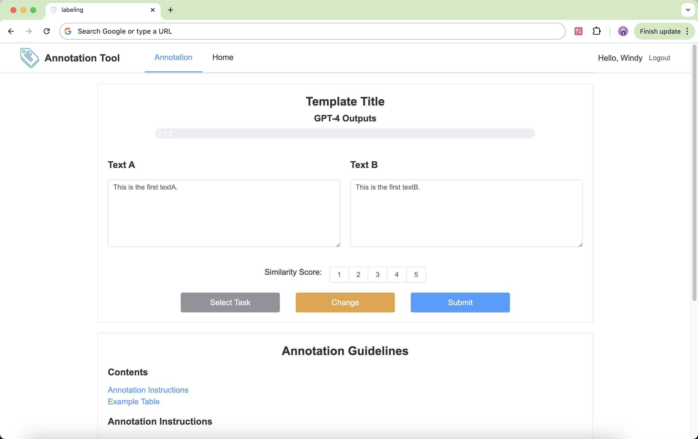

# An Easily Extensible Labeling Annotation Web Tool (Flask + Vue 3)

An Easily Extensible Labeling Annotation Web with separated frontend and backend. The backend uses Flask (Python) for data management and API provision, while the frontend uses Vue 3 (with Element-Plus) for visual interface and interaction logic.

[中文文档](./README_zh.md)



## Feature Overview

### 1. Backend (Flask + SQLite)
- Provides RESTful API endpoints, such as getting the next unannotated data, submitting annotation results, getting annotation progress, etc.
- Built-in scoring annotation logic: BaseAnnotation base class, customizable scoring logic
- Supports data import (load_data.py) and export (export_data.py) to JSON files
- Uses SQLite database by default for data persistence

### 2. Frontend (Vue 3 + Element-Plus)
- Initialized with Vue CLI, built-in routing and state management examples
- Integrates Element-Plus [https://element-plus.org/en-US/] component library, providing rich UI components (forms, buttons, dialogs, progress bars, etc.)
- Provides a typical text comparison + scoring annotation interface AnnotationView.vue, which can be used as a base for developing various annotation methods

### 3. Extensibility

#### Backend:
- Add custom logic classes in the annotation_types folder, inheriting from BaseAnnotation
- Modify or add database table structures to accommodate different types of annotations (multiple-choice annotation, named entity recognition, etc.)

#### Frontend:
- Modify views/AnnotationView.vue or create new components to extend text display methods, button layouts, or scoring dimensions
- Use Vuex for global state management (such as user information, permissions, etc.), add new pages or functional modules through Vue Router

## Project Structure

```
.
├── .gitignore
├── README.md                        # This file
├── backend/
│   ├── app.py                       # Flask entry, register routes, start service
│   ├── config.py                    # Backend configuration (database, server port, CORS, etc.)
│   ├── load_data.py                 # Import JSON data to database
│   ├── export_data.py               # Export annotation results from database to JSON
│   ├── annotation_types/            # Store annotation logic classes
│   │   ├── base.py                  # Annotation logic base class
│   │   └── scoring.py               # Example scoring annotation logic
│   ├── database/                    # Database related tools
│   │   └── db_utils.py              # Database initialization, connection, table creation
│   └── requirements.txt             # Python dependencies
├── frontend/
│   ├── package.json                 # Frontend dependencies
│   ├── public/
│   │   └── index.html               # Frontend entry file
│   ├── src/
│   │   ├── api/                     # axios encapsulation and backend interaction
│   │   ├── components/              # components
│   │   ├── constants/               # global configuration
│   │   ├── layouts/                 # layout components
│   │   ├── views/                   # view components
│   │   ├── store/                   # Vuex state management
│   │   ├── router/                  # Vue Router configuration
│   │   └── main.ts                  # Vue application entry
│   └── vue.config.js                # Frontend service configuration
└── ...
```

## Quick Start

### 0. configure port, ip, etc.
- Modify backend/config.py CORS.ORIGINS to the frontend service YOUR_IP:port
- Modify frontend/src/constants/config.ts API.BASE_URL to the backend service YOUR_IP:port
### 1. Start Backend (Flask)

#### Install Dependencies

```bash
cd backend
# Recommend using virtual environment (venv/conda) to isolate environment
conda create -n flask python=3.9
conda activate flask
pip install -r requirements.txt
```

#### Import Data (Required for first start, skip for subsequent starts)

```bash
python load_data.py --file data_to_load.json
```

This will read JSON content and write to the annotation_data table. You can extend load_data.py according to field requirements.

#### Start Backend Service

```bash
python app.py
```

After successful start, you can access http://your_ip:5000. This address provides routes like /api/annotation/next, /api/annotation/submit for annotation operations.

#### Export Annotation Results (Optional)

```bash
python export_data.py --output results.json
```

If --output is not specified, it will automatically generate a filename with timestamp.

### 3. Start Frontend (Vue 3)

#### Install Dependencies

```bash
cd ../frontend
npm install
```

#### Start Frontend Service

```bash
npm run serve
```

By default, it will start the development server at http://your_ip:8080 (port can be changed in ./frontend/src/constants/config.ts).

#### Access Annotation Page
Open browser and visit http://your_ip:8080 to see the example annotation interface. The frontend will call the APIs provided by the backend to get/submit annotation data.

## How to Customize the Annotation System

### 1. Customize Annotation Logic
To implement new annotation types (such as multiple-choice annotation, sequence annotation, etc.), you need to modify these files:

1. **backend/annotation_types/** directory
   - Create new annotation type file (e.g., multiple_choice.py)
   - Inherit from BaseAnnotation class in base.py
   - Implement necessary methods (get_next_data, submit_annotation, get_progress)

2. **backend/database/db_utils.py**
   - Add new table definitions in init_db() function
   - Design appropriate table structure for new annotation type

3. **backend/app.py**
   - Import new annotation class
   - Add corresponding API routes
   - Implement route handling logic

### 2. Customize Frontend Interface
To implement new annotation interfaces, you need to modify these files:

1. **frontend/src/views/**
   - Create or modify view components (e.g., MultipleChoiceView.vue)
   - Implement annotation interface template and interaction logic

2. **frontend/src/router/routes.ts**
   - Add route configuration for new view
   - Set route parameters and meta information

3. **frontend/src/api/annotation.ts**
   - Add API call functions corresponding to new annotation type
   - Define request and response data types

4. **frontend/src/store/** (Optional)
   - Add new store module if global state management is needed
   - Implement state management related logic
   
### 3. Extend Data Import/Export
If the new annotation type needs special data format:

1. **backend/load_data.py**
   - Modify data import logic
   - Add data format validation

2. **backend/export_data.py**
   - Modify data export logic
   - Adjust export file format

## Actual Deployment
Since it's a simple annotation system, actual deployment might not be necessary.

If deployment is needed, deploy frontend static files through Nginx and start backend service through Gunicorn.

## Currently Not Supported
- User login and permission management
- Annotation result visualization
